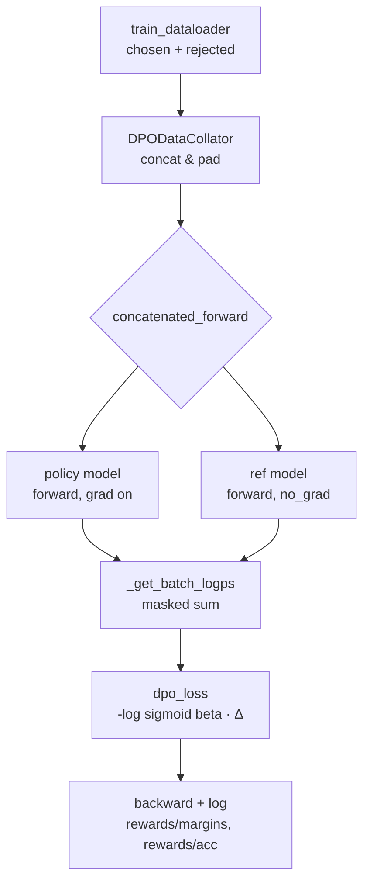

# Lesson 11: TRL DPOTrainer 源码精读

## 学习目标
- 在 TRL 仓库里**定位** `DPOTrainer` 的核心实现路径，画出 `trainer.train()` → 数据 collator → forward → loss 的调用链
- 看懂 DPO 训练的 **6 个核心模块**：数据格式、collator 拼接、policy/ref 两路 forward、log_prob 计算、DPO loss、诊断指标
- 把 `DPOConfig` 的关键参数（`beta`、`loss_type`、`reference_free`、`max_length` / `max_prompt_length`）映射到阶段二 Lesson 11 的理论变量
- 通过 `loss_type` 这个开关，掌握 **DPO / IPO / KTO / SimPO 等变体在源码层面的实现差异**
- 在 CPU + `Qwen2.5-0.5B` + 10 条偏好数据 + `max_steps=2` 的设置下把 DPOTrainer 跑空转，确认 shape / loss / `rewards/margins` 都能正常输出

> 本节走的是**流程 A（详细 6 步）**——`DPOTrainer` 是算法代码，含具体 loss 实现，不是薄编排层。

---

## 学完后能口头复述什么

合上电脑你应该能说出：

1. TRL 里 DPO 的源码大致在哪几个文件（`trl/trainer/dpo_trainer.py` / `dpo_config.py` / `data_utils.py`）
2. 喂给 `DPOTrainer` 的偏好数据集需要哪几个字段，每个字段长啥样
3. DPOTrainer 的一个 `train_step` 在做什么：拼接 chosen + rejected → 一次 forward 出 4 个 log_prob → 套 DPO loss
4. `DPOConfig.beta` 影响什么，`loss_type` 改成 `"ipo"` / `"kto"` / `"simpo"` 时源码改了哪一行
5. 阶段四你想用 DPO 做对齐时，要踩的 3 个坑（chat template、ref 的处理、长度偏置）

---

## 知识小节

### 小节 1：DPOTrainer 在 TRL 仓库里的位置

```
trl/
├── trainer/
│   ├── dpo_trainer.py         ← 主类 DPOTrainer
│   ├── dpo_config.py          ← DPOConfig（含 beta / loss_type / ref ...）
│   └── utils.py               ← DPODataCollatorWithPadding 等工具
└── ...
```

定位方法（学生跟着做一遍）：
```bash
python -c "import trl, os; print(os.path.dirname(trl.__file__))"
# 进到该目录，看 trainer/dpo_trainer.py 第一行附近的导入和类定义
```

**关键 import**（约 50 行内能看到的几样东西，作为"地图"）：
- 继承自 HF `Trainer`（和 SFTTrainer 一样的套路）
- 用到 `nn.functional.logsigmoid`（DPO loss 的核心数值稳定函数）
- 有 `_get_batch_logps` / `concatenated_forward` 这种私有方法（是后面的重点）

---

### 小节 2：DPO 期望的数据格式

TRL 约定的偏好数据集字段（最常见的两种格式）：

**格式 A：纯 prompt + 两个回答**
```python
{
    "prompt":   "请解释一下 RLHF 是什么？",
    "chosen":   "RLHF 是一种通过人类偏好对齐 LLM 的方法 ...",
    "rejected": "RLHF 就是 R-L-H-F，我也不知道。"
}
```

**格式 B：messages 对话格式**（TRL 新版更鼓励）
```python
{
    "chosen":  [{"role":"user","content":"..."},{"role":"assistant","content":"好答案"}],
    "rejected":[{"role":"user","content":"..."},{"role":"assistant","content":"坏答案"}],
}
```

`DPOTrainer.__init__` 会自动检测格式 → 应用 `tokenizer.chat_template` → 转成 token id。

**对照阶段二**：这就是 Lesson 4 训练 Reward Model 用的 `(x, y_w, y_l)` 三元组——**完全同一份数据，DPO 只是用法变了**。

---

### 小节 3：核心调用链（流程 A 第 2 步）

```
DPOTrainer.train()         ← 来自 HF Trainer，外层训练循环
   └── training_step(batch)
         └── compute_loss(model, inputs)
              └── concatenated_forward(model, batch)     ← 关键：一次 forward 算 4 个 log_prob
                    ├── tokenize/pad chosen + rejected
                    ├── 同一个 model 跑一次（policy）
                    └── 同一个 ref_model 跑一次（no_grad）
              └── dpo_loss(policy_logps, ref_logps)      ← 真正的 DPO loss 计算
                    └── F.logsigmoid(beta * (Δ_policy - Δ_ref))
              └── 记录 rewards/chosen, rewards/rejected, rewards/margins
```

**Mermaid 视角**（讲课时用 `renderMermaidDiagram` 渲染）：



---

### 小节 4：concatenated_forward — 为什么要"拼起来一起 forward"

简化版（剥掉错误处理后的本质）：

```python
def concatenated_forward(self, model, batch):
    """
    把 chosen 和 rejected 在 batch 维度拼起来，一次 forward 同时算出
    log π(y_w) 和 log π(y_l)，省一次显存调度。
    """
    # batch 里已经有 "concatenated_input_ids" 和 "concatenated_labels"
    # 前一半是 chosen，后一半是 rejected
    concat_input_ids = batch["concatenated_input_ids"]   # [2B, T]
    concat_labels    = batch["concatenated_labels"]      # [2B, T]，prompt 部分被设成 -100

    all_logits = model(concat_input_ids).logits          # [2B, T, V]
    all_logps  = self._get_batch_logps(all_logits, concat_labels)  # [2B]

    B = concat_input_ids.shape[0] // 2
    chosen_logps   = all_logps[:B]   # log π_θ(y_w | x)
    rejected_logps = all_logps[B:]   # log π_θ(y_l | x)
    return chosen_logps, rejected_logps
```

**关键工程点**（学生要记住）：
- `concatenated_labels` 用 `-100` mask 掉 prompt 部分——和 SFT 完全一样的套路（对照阶段二 Lesson 7）
- chosen 和 rejected 拼起来一次 forward = 等价于做了两次 forward，但**减少了 batch-time overhead**
- ref_model 也走同一个函数，只是包在 `torch.no_grad()` 里

---

### 小节 5：`_get_batch_logps` — log_prob 是怎么按 token 加起来的

```python
def _get_batch_logps(self, logits, labels):
    """
    每条样本"回答部分"的总 log 概率（masked sum 或 mean）。

    logits: [B, T, V]
    labels: [B, T]，prompt 部分是 -100
    """
    labels = labels[:, 1:].clone()                      # shift，预测下一个 token
    logits = logits[:, :-1, :]                          # [B, T-1, V]
    loss_mask = labels != -100                          # 只在回答 token 上算

    labels[labels == -100] = 0                          # gather 不能用负 index，先 dummy 化
    per_token_logps = torch.gather(
        logits.log_softmax(-1), dim=2, index=labels.unsqueeze(2)
    ).squeeze(2)                                        # [B, T-1]

    # 默认 sum：DPO 原版用 sum_over_response_tokens
    # 切到 SimPO 时用 mean，这就是 SimPO 在源码层面的核心改动
    return (per_token_logps * loss_mask).sum(-1)
```

> **映射阶段二 Lesson 11**：这就是公式里的 $\log\pi_\theta(y|x) = \sum_t \log\pi_\theta(y_t \mid y_{<t}, x)$。

**SimPO 的源码差异**：在 TRL 里把这一行的 `.sum(-1)` 换成 `.sum(-1) / loss_mask.sum(-1).clamp(min=1)`——**就是"用平均 log-prob 当 reward"**，自动带长度归一。

---

### 小节 6：DPO loss 实现 — 一行 `F.logsigmoid` 解决战斗

DPOTrainer 里的 `dpo_loss`（核心约 15 行）：

```python
def dpo_loss(
    self,
    policy_chosen_logps,    # [B]
    policy_rejected_logps,  # [B]
    reference_chosen_logps, # [B]  no grad
    reference_rejected_logps# [B]  no grad
):
    pi_logratios  = policy_chosen_logps  - policy_rejected_logps
    ref_logratios = reference_chosen_logps - reference_rejected_logps

    logits = pi_logratios - ref_logratios   # 阶段二 Lesson 11 的 Δ_policy − Δ_ref

    if self.loss_type == "sigmoid":         # 标准 DPO
        losses = -F.logsigmoid(self.beta * logits)
    elif self.loss_type == "ipo":            # IPO：抗噪声变体
        losses = (logits - 1 / (2 * self.beta)) ** 2
    elif self.loss_type == "kto_pair":       # KTO 的成对版
        # 不再用 sigmoid 偏好，改用 prospect-theory 风格 utility
        ...
    elif self.loss_type == "simpo":          # SimPO：reference-free + 长度归一
        # logits 这里已经是用 mean log-prob 算出来的了
        losses = -F.logsigmoid(self.beta * logits - self.gamma_beta_ratio)

    # 诊断指标（实战里你天天盯它们，比 loss 重要）
    chosen_rewards   = self.beta * (policy_chosen_logps   - reference_chosen_logps).detach()
    rejected_rewards = self.beta * (policy_rejected_logps - reference_rejected_logps).detach()

    return losses.mean(), chosen_rewards, rejected_rewards
```

**对应阶段二 Lesson 11 的几条核心结论**：
- 公式上写的 $\beta(\log\tfrac{\pi_\theta(y_w)}{\pi_{\text{ref}}(y_w)} - \log\tfrac{\pi_\theta(y_l)}{\pi_{\text{ref}}(y_l)})$ → 代码里 `beta * (pi_logratios - ref_logratios)`
- 隐式 reward $\hat r = \beta \log(\pi_\theta / \pi_{\text{ref}})$ → 代码里 `chosen_rewards / rejected_rewards`
- `loss_type` 就是**变体开关**：DPO 阵营里 IPO / KTO / SimPO 等"换一个 loss 函数"的算法，全都在这一个 if-elif 里实现

---

### 小节 7：DPOConfig 的关键参数速查

| 参数 | 默认 | 含义 | 阶段二映射 |
|---|---|---|---|
| `beta` | 0.1 | KL 约束强度 | Lesson 11 公式里的 β |
| `loss_type` | `"sigmoid"` | 选择算法变体（dpo / ipo / kto_pair / simpo / ...） | Lesson 11"变体一览表" |
| `reference_free` | `False` | 是否完全去掉 ref_model | ORPO / SimPO 路线 |
| `max_length` | 1024 | 单条 (prompt + response) 最大 token | 工程上限 |
| `max_prompt_length` | 512 | 仅 prompt 的最大 token | 截断保护 |
| `precompute_ref_log_probs` | `False` | 训练前一次性算完 ref log_prob，省显存 | 用空间换显存的常见技巧 |
| `disable_dropout` | `True` | 关闭策略和 ref 的 dropout | 保证两路 forward 一致 |

**踩坑点（学生常错）**：
1. `tokenizer.chat_template` 必须设好，否则 chosen / rejected 在 DPOTrainer 内部 apply template 时会报错
2. `max_prompt_length` 太大 → ref + policy 显存爆，CPU 直接 OOM
3. `reference_free=True` 时千万别再传 `model_ref`，会被忽略且让人困惑

---

### 小节 8：从 DPOTrainer 反向映射 PPO/GRPO 的取舍

学生看完源码后应该能脑补出这张表：

| 你在 TRL 里看到的 | DPO | GRPO |
|---|---|---|
| 需要在线 `generate` 吗 | ❌ 不需要 | ✅ 必须 |
| 需要 `reward_funcs` 吗 | ❌ 不需要 | ✅ 必须 |
| 训练循环像谁 | **几乎和 SFTTrainer 一样** | 多一层"采样 → 打分 → 更新" |
| 显存里有几份模型 | policy + ref（≈ 2×） | policy + ref（vLLM 共享或独立，≈ 2-3×） |
| 单步训练用时 | 取决于 forward | + 一次完整 generate（慢得多） |

**这就是为什么很多团队的工业管线先 DPO 跑通对齐，再上 GRPO 做推理**——DPO 在工程上"几乎免费"。

---

## 动手脚本（CPU 可跑，约 30 秒）

`lessons/cr_lesson11_dpo_toy.py`：

```python
"""
TRL DPOTrainer toy run（CPU 友好版，max_steps=2）

目的：验证 DPOTrainer 在普通笔记本上能走通，并打印 4 个关键 log_prob
和 rewards/margins 指标，确认与阶段二 Lesson 11 公式一致。
"""
import torch
from datasets import Dataset
from transformers import AutoModelForCausalLM, AutoTokenizer
from trl import DPOTrainer, DPOConfig

MODEL = "Qwen/Qwen2.5-0.5B"   # CPU 也能塞下

# 1. tokenizer + chat template
tokenizer = AutoTokenizer.from_pretrained(MODEL)
if tokenizer.pad_token is None:
    tokenizer.pad_token = tokenizer.eos_token

# 2. 偏好数据：10 条手工对，能体现"好 vs 差"的明显风格差
prefs = [
    {
        "prompt":   "What is 2+2?",
        "chosen":   "2 + 2 equals 4.",
        "rejected": "It's probably around 5 or 6.",
    },
] * 10
ds = Dataset.from_list(prefs)

# 3. policy & ref（ref 通常就是 SFT；这里直接拿同一个 base 演示）
policy = AutoModelForCausalLM.from_pretrained(MODEL)
ref    = AutoModelForCausalLM.from_pretrained(MODEL)

# 4. DPOConfig：toy 跑空转
cfg = DPOConfig(
    output_dir="./out_dpo_toy",
    per_device_train_batch_size=1,
    max_steps=2,                       # 只验证能跑通
    learning_rate=5e-6,
    beta=0.1,                          # ← 阶段二 Lesson 11 的 β
    loss_type="sigmoid",               # 标准 DPO；试 "ipo" / "simpo" 也很有意思
    max_length=128,
    max_prompt_length=64,
    bf16=False,                        # CPU 必须关
    report_to="none",
    logging_steps=1,
)

# 5. 起训
trainer = DPOTrainer(
    model=policy,
    ref_model=ref,
    args=cfg,
    train_dataset=ds,
    processing_class=tokenizer,        # 新版 TRL 用 processing_class
)
trainer.train()

print("\n==== 看 logging 里有没有这些指标 ====")
print("  loss               # DPO loss")
print("  rewards/chosen     # β·Δlog π(chosen)，应该缓慢上涨")
print("  rewards/rejected   # β·Δlog π(rejected)，应该缓慢下降")
print("  rewards/margins    # chosen - rejected，DPO 的真正信号")
print("  rewards/accuracies # margin > 0 的比例，应该接近 1.0")
```

**预期结果**：
- 不会真的学到东西（只跑了 2 步），但能跑通；
- log 里能看到 `rewards/chosen`、`rewards/rejected`、`rewards/margins`、`rewards/accuracies` 四个 metric；
- 把 `loss_type` 改成 `"ipo"` 或 `"simpo"` 再跑一次，能看到 loss 数值范围不一样——直观感受不同变体的工程差异。

---

## 关键问答 & 踩坑点

**Q1**：为什么 DPOTrainer 用 `processing_class=tokenizer` 而 SFTTrainer 老版本用 `tokenizer=`？
**A**：新版 TRL 统一了多模态/纯文本的接口，`processing_class` 是 HF Trainer 在 4.45+ 的新约定。老代码会 deprecation warning，但能用。

**Q2**：源码里 `concatenated_forward` 为什么要把 chosen / rejected 拼起来，而不是分两次 forward？
**A**：减少 batch-time overhead，让 `attention` 等核函数能一次性吃完整个 mini-batch。功能上等价于做两次。

**Q3**：`precompute_ref_log_probs=True` 适合什么时候开？
**A**：ref 永远不变 → 训练前一次性算完所有 batch 的 ref log_probs 存盘，训练时不再调 ref forward，**显存少一半，速度提一倍**。代价：第一次预计算很慢，且数据集不能太大。

**Q4**：如果偏好数据全是 chosen 比 rejected 长很多，会怎样？
**A**：长度偏置——`log_prob` 是 sum 越长越负，DPO 会**变相奖励长答案**。修法：用 `loss_type="simpo"`（自带长度归一）或在数据上做长度匹配。

**Q5**：DPOTrainer 能不能在没 ref_model 的情况下训练？
**A**：能，设 `reference_free=True`（实际等价于 ORPO 类思想，把 ref 的 log_ratio 置零）。但严格 DPO 推导是有 ref 的，去掉相当于换了算法。

---

## 测验题

**Q1**（代码定位，4分）
在 TRL 源码中，DPO loss 的核心计算在哪个文件的哪个方法？写出文件名 + 方法名。

**答案**：`trl/trainer/dpo_trainer.py` 中的 `DPOTrainer.dpo_loss`（或新版叫 `_compute_loss`）。其中关键一行是 `-F.logsigmoid(self.beta * logits).mean()`。

---

**Q2**（原理映射，4分）
源码里 `pi_logratios - ref_logratios` 这个差，对应阶段二 Lesson 11 公式里的哪一部分？为什么要算这个"差中差"？

**答案**：对应公式
$\beta\left[\log\tfrac{\pi_\theta(y_w)}{\pi_{\text{ref}}(y_w)} - \log\tfrac{\pi_\theta(y_l)}{\pi_{\text{ref}}(y_l)}\right]$
中括号里的部分。算"差中差"是因为 DPO 推导里 $\log Z(x)$ 在 chosen 和 rejected 上相同会自动抵消，剩下的就是策略与参考的对数比再做一次差。

---

**Q3**（变体识别，4分）
读下面这段简化源码，判断它实现的是 DPO / IPO / SimPO 中的哪一个，并解释关键区别：

```python
losses = (logits - 1 / (2 * self.beta)) ** 2
```

**答案**：**IPO**。区别：标准 DPO 是 $-\log\sigma(\beta \cdot \text{logits})$，IPO 把它换成 $(\text{logits} - \tfrac{1}{2\beta})^2$ 的平方项，目的是抑制 DPO 在带噪偏好数据上的过拟合（DPO 会无限制拉大 chosen / rejected 的 log_prob 差，IPO 给一个目标值约束住）。

---

**Q4**（AI 代码审查，4分）
某 AI 助手生成了下面这段 DPO 训练代码，找出至少 3 个会让训练**跑不起来或跑出错误结果**的问题：

```python
trainer = DPOTrainer(
    model=model,
    ref_model=model,                        # ❌
    args=DPOConfig(
        output_dir="./out",
        beta=0.0,                           # ❌
        loss_type="ipo",
        reference_free=True,                # ❌ + 上面冲突
        bf16=True,                          # CPU 上会炸
    ),
    train_dataset=Dataset.from_list([{"prompt": "x", "response": "y"}]),  # ❌ 字段错
)
```

**答案要点**（每条 1 分，4 条得满）：
1. **`ref_model=model`**：和 policy 共享对象 → ref 也跟着更新，KL 锚失效（应该 deepcopy 或重新加载一份）。
2. **`beta=0.0`**：β=0 等价于关掉 KL 约束，DPO 公式里 `β * logits = 0`，loss 退化为常数 `-log(0.5)`，**学不到东西**。
3. **`reference_free=True` 同时又传 `ref_model`**：参数冲突，TRL 会忽略 ref 但配置很混乱。
4. **数据字段错**：DPO 需要 `chosen / rejected`，不是 `response`，trainer 会在 prepare_dataset 时报错。
5. **CPU 上 `bf16=True`** 会直接抛 RuntimeError。

---

## 课后练习（选做）

1. 把 `loss_type` 在 `"sigmoid" / "ipo" / "simpo"` 三个值上各跑一次 toy run，对比 `rewards/margins` 的初始数值——感受不同算法的"起点"差异。
2. 把 `precompute_ref_log_probs=True` 开起来，看训练前的预计算阶段在做什么，源码哪里调用。
3. 顺着 `concatenated_forward` 往上读，弄清楚 `DPODataCollator` 是怎么把 chosen 和 rejected 在 batch 维度拼起来的，画一张 shape 变化图。
4. **阶段四迁移清单**：把本节学到的"DPO 工程检查表"写成 10 条，含字段名、关键 config、典型坑——给阶段四直接用。
